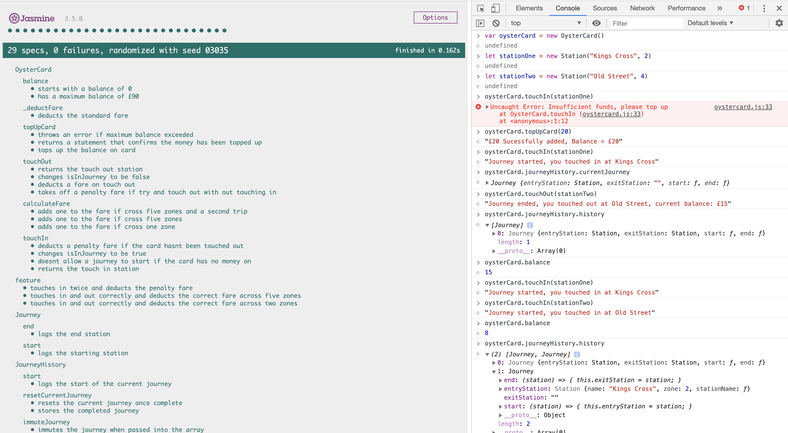

# OysterCard - JavaScript

## Overview

Simple JavaScript app that is run in the console to emulate using an Oystercard on the london underground. Test driven in ES6 with the Jasmine testing suite. A user can touch in and out on a journey, it will calculate the fare and store the journey history. It will deduct a penalty fare if the journey isnt complete ie you dont touch in or you dont touch out and will throw an error if there are insufficient funds on the card.

## User Stories

```
In order to use public transport
As a customer
I want money on my card

In order to keep using public transport
As a customer
I want to add money to my card

In order to protect my money
As a customer
I don't want to put too much money on my card

In order to pay for my journey
As a customer
I need my fare deducted from my card

In order to get through the barriers
As a customer
I need to touch in and out

In order to pay for my journey
As a customer
I need to have the minimum amount for a single journey

In order to pay for my journey
As a customer
I need to pay for my journey when it's complete

In order to pay for my journey
As a customer
I need to know where I've travelled from

In order to know where I have been
As a customer
I want to see to all my previous trips

In order to know how far I have travelled
As a customer
I want to know what zone a station is in

In order to be charged correctly
As a customer
I need a penalty charge deducted if I fail to touch in or out

In order to be charged the correct amount
As a customer
I need to have the correct fare calculated
```

## How to run

Clone this repo, navigate into the Jasmine file

Right click on `SpecRunner.html` click `copy path` and paste the path into the browser of your choice

To use the program open up the console and type the following:

```
let oysterCard = new OysterCard()
let stationOne = new Station("Kings Cross", 2)
let stationTwo = new Station("Old Street", 4)
```

Once you have instantiated these, you can then top up your card and travel touching in and out at different stations that you make:

```
oysterCard.topUpCard(20)
oysterCard.touchIn(stationOne)
oysterCard.touchOut(stationTwo)
```

The program will calculate your balance after you have topped up and deduct a fare each time you touch in and out at different stations depending on how many zones you travel across. You can check the balance of the card at any time running:

```
oysterCard.balance
```

You can check the current journey you are on, running:

```
oysterCard.journeyHistory.currentJourney
```

The program will also log your journey history, which you can see at anytime running:

```
oysterCard.journeyHistory.history
```

The standard fare across the same zone is £3 and then an extra £1 will be added for each zone that you travel across.

If you forget to touch in or out somewhere the penalty fare of £7 will be deducted from your card.

The program will throw an error if there are insufficient funds on the card and wont let touch in somewhere until you top up.

## How to run tests

Once you have cloned the repo open the jasmine folder.

Right click on `SpecRunner.html` click `copy path` and paste the path into the browser of your choice

Once open in the browser you should see 29 Jasmine tests passing (please see in example below).

## Example


